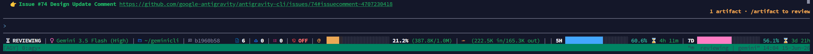
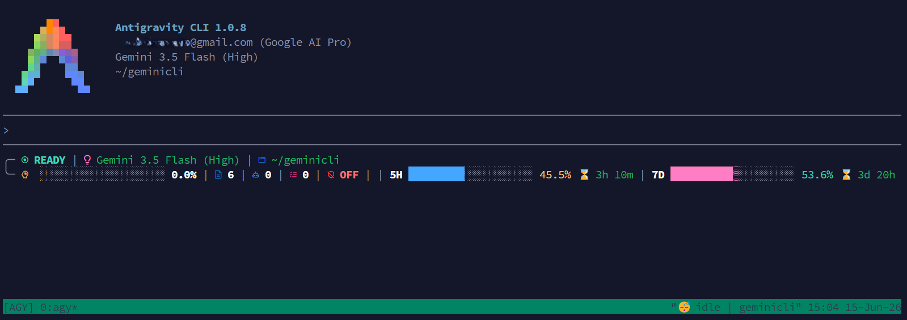

# 🚀 Antigravity CLI Statusline (Max Edition)

An advanced, responsive, and high-information statusline plugin for the **Antigravity CLI** (`agy`). It features multi-layout adapting to your terminal width, real-time Git status tracking, token counting, active model quotas, and sandbox badges.

---

## 🎨 Layout Showcase

### 🖥️ Wide Layout (Terminal width $\ge$ 180 chars)
Provides a rich, single-row layout displaying all developer telemetry and active quotas side-by-side.


### 📱 Medium Layout (Terminal width $\ge$ 90 chars)
Wraps status into a clean two-line boxed block to avoid command output line wrap.


---

## ✨ Features

- **Responsive Design:** Automatically switches layouts (Wide, Medium, Small) depending on terminal width (`terminal_width`) to avoid messy line wrapping.
- **Smart Git Tracking:** Queries the Git binary (`git -C`) directly to get real-time branch status and dirty states, bypassing cached session details.
- **Dynamic Quota Swapping:** Automatically detects the current LLM model (Gemini vs. 3rd-party models) and switches to display the correct active quotas (`gemini-5h` & `gemini-weekly` or `3p-5h` & `3p-weekly`) along with countdowns to quota reset.
- **Context & Token Metres:** Displays a visual 20-segment context window bar with percentage, and displays input/output tokens in a human-readable (`K`, `M`) format.
- **Sandbox Network Badges:** Displays whether the execution sandbox is `ON (net)`, `ON (no-net)`, or `OFF`.
- **Background Actions Tracker:** Live metrics showing active subagents count (`󱙺`) and running background tasks (``).

---

## 📥 Installation

Choose the installation command for your operating system:

### 🐧 macOS / Linux
Run this one-liner to clone the repository to a temporary directory and run the installer:
```bash
git clone https://github.com/weby-homelab/antigravity-cli-statusline.git /tmp/antigravity-cli-statusline && /tmp/antigravity-cli-statusline/install.sh
```

**Manual Installation:**
1. Clone this repository:
   ```bash
   git clone https://github.com/weby-homelab/antigravity-cli-statusline.git
   ```
2. Navigate to the directory and run the installer:
   ```bash
   cd antigravity-cli-statusline
   ./install.sh
   ```

---

### 🪟 Windows (PowerShell)
Run this one-liner in PowerShell (run as Administrator if your execution policy is restricted):
```powershell
git clone https://github.com/weby-homelab/antigravity-cli-statusline.git $env:TEMP/antigravity-cli-statusline; cd $env:TEMP/antigravity-cli-statusline; Powershell -NoProfile -ExecutionPolicy Bypass -File .\install.ps1
```

**Manual Installation:**
1. Clone this repository:
   ```powershell
   git clone https://github.com/weby-homelab/antigravity-cli-statusline.git
   ```
2. Navigate to the directory and execute:
   ```powershell
   cd antigravity-cli-statusline
   Powershell -NoProfile -ExecutionPolicy Bypass -File .\install.ps1
   ```

---

## 🗑️ Uninstallation

If you wish to remove the statusline, you can run the uninstaller script.

### 🐧 macOS / Linux
```bash
cd antigravity-cli-statusline
./uninstall.sh
```

### 🪟 Windows (PowerShell)
```powershell
cd antigravity-cli-statusline
Powershell -NoProfile -ExecutionPolicy Bypass -File .\uninstall.ps1
```

---

## ⚙️ Configuration Details
The installation script updates your `settings.json` (located at `~/.gemini/antigravity-cli/settings.json`) to register the statusline hook:

```json
{
  "statusLine": {
    "type": "",
    "command": "/home/user/.antigravity/statusline.sh",
    "enabled": true
  }
}
```

On Windows, the command will be registered to run via PowerShell with execution policy bypass flags.
