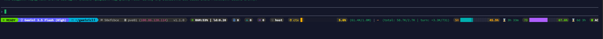
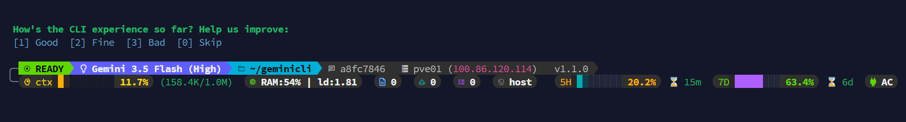
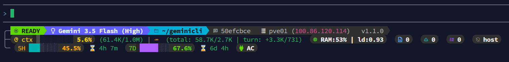
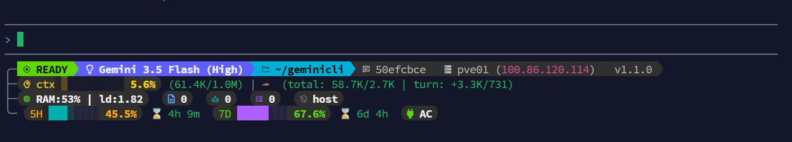

# Antigravity CLI Statusline

[](https://github.com/weby-homelab/antigravity-cli-statusline/releases/latest)
[](#supported-platforms)

Add an adaptive telemetry statusline to [Antigravity CLI](https://github.com/weby-homelab/antigravity-cli). It shows session, model, Git, context, quota, sandbox, task, host, and power data, then packs available fields across rows as terminal width changes.



> [!NOTE]
> The Weby Homelab community fork of Antigravity CLI installs this statusline by default. Follow this README to install it with another Antigravity CLI build, reinstall it, or change its display mode.

## What the statusline shows

The renderer combines data from the Antigravity CLI statusline payload with local Git and host diagnostics:

- **Session**: agent state, active model, CLI version, account tier, email, and conversation ID
- **Workspace**: shortened working directory, Git branch, and dirty state
- **Usage**: context consumption, session and current-turn tokens, active model quota, and reset countdowns
- **Execution**: sandbox network mode, artifacts, subagents, and background tasks
- **Host**: hostname, Tailscale IPv4 address when available, power source, and battery charge
- **Linux diagnostics**: memory use and one-minute load average when `/proc` exposes them

The statusline reads Antigravity CLI data from standard input. The renderer itself does not send session data over the network.

## Choose a display mode

The default preset uses 256-color ANSI styling and [Nerd Fonts 3](https://www.nerdfonts.com/) glyphs. Its line-packing engine measures each telemetry badge and adds rows when the current terminal width cannot contain the next badge.

| Bash terminal width | Representative output | Context and quota bars |
| --- | --- | --- |
| 180 columns or wider | Wide layout | 20 and 15 segments |
| Below 180 columns | Packed multiline layout | 10 and 8 segments |

The PowerShell renderer uses 20-segment context and quota bars at every width. On both renderers, the final row count depends on the telemetry available in the current session. These screenshots show common Bash results at four widths.

<details>
<summary>View responsive layout examples</summary>

### Wide terminal


### Medium-wide terminal



### Medium terminal



### Compact terminal



</details>

Use classic mode when your terminal does not have a Nerd Font. It replaces private-use glyphs and 256-color capsules with Unicode labels and 16-color ANSI output.

## Supported platforms

Install the implementation for your operating system:

| Platform | Renderer | Requirements | Optional integrations |
| --- | --- | --- | --- |
| Linux | `statusline.sh` | Bash and `jq` | Git, GNU `timeout`, Tailscale, `/proc`, `/sys/class/power_supply` |
| macOS | `statusline.sh` | Bash and `jq` | Git, Tailscale, `pmset` |
| Windows | `statusline.ps1` | Windows PowerShell 5.1 or newer | Git, Tailscale, Common Information Model (CIM) battery data |

Git is optional. Without it, the statusline omits live branch and dirty-state data.

## Install or upgrade

The installers copy the renderer and uninstaller to `~/.antigravity`, update the `statusLine` object in Antigravity CLI settings, and preserve existing settings in `settings.json.bak`.

> [!WARNING]
> Run the installer as your normal account. Do not use `sudo`: the installer writes to your home directory.

> [!TIP]
> Review [`install.sh`](install.sh) or [`install.ps1`](install.ps1) before executing a remote script.

### Linux and macOS

Install `jq`, then run the installer with either `curl` or `wget`.

```bash
curl -fsSL https://raw.githubusercontent.com/weby-homelab/antigravity-cli-statusline/main/install.sh | bash
```

The equivalent `wget` command is:

```bash
wget -qO- https://raw.githubusercontent.com/weby-homelab/antigravity-cli-statusline/main/install.sh | bash
```

### Windows PowerShell

Run the installer from PowerShell:

```powershell
powershell -NoProfile -ExecutionPolicy Bypass -Command "iex (irm https://raw.githubusercontent.com/weby-homelab/antigravity-cli-statusline/main/install.ps1)"
```

Restart Antigravity CLI after installation. Rerun the same installer to upgrade the statusline.

## Configure the statusline

The installer updates one of these files:

- **Linux and macOS**: `~/.gemini/antigravity-cli/settings.json`
- **Windows**: `%USERPROFILE%\.gemini\antigravity-cli\settings.json`

A Linux configuration has this shape:

```json
{
  "statusLine": {
    "type": "",
    "command": "/home/your_username/.antigravity/statusline.sh",
    "enabled": true
  }
}
```

On macOS, replace `/home/your_username` with `/Users/your_username`. On Windows, use this command value:

```json
{
  "statusLine": {
    "type": "",
    "command": "powershell -NoProfile -ExecutionPolicy Bypass -File \"C:/Users/your_username/.antigravity/statusline.ps1\"",
    "enabled": true
  }
}
```

### Use classic mode

Append `--classic` to the configured command:

```json
{
  "statusLine": {
    "type": "",
    "command": "/home/your_username/.antigravity/statusline.sh --classic",
    "enabled": true
  }
}
```

The Bash and PowerShell renderers also accept `--no-nerdfont` and `--compatibility`.

### Override the Bash layout width

The Bash renderer accepts three flags that replace the width reported by Antigravity CLI:

| Flag | Effective width | Intended result |
| --- | ---: | --- |
| `--compact` | 89 columns | Compact packed output |
| `--medium` | 120 columns | Medium packed output |
| `--medium-wide` | 150 columns | Medium-wide packed output |

Append one flag to the `command` value in `settings.json`. The PowerShell renderer does not currently implement these width overrides.

## Verify the installation

Check the installed version and print the live icon legend after installation.

### Linux and macOS

```bash
~/.antigravity/statusline.sh --version
~/.antigravity/statusline.sh --legend
```

The short forms are `-v` and `-l`.

### Windows PowerShell

```powershell
powershell -NoProfile -ExecutionPolicy Bypass -File "$HOME\.antigravity\statusline.ps1" -Version
powershell -NoProfile -ExecutionPolicy Bypass -File "$HOME\.antigravity\statusline.ps1" -Legend
```

The Windows renderer also accepts `--version`, `-v`, `--legend`, and `-l`.

<details>
<summary>View the graphical telemetry legend</summary>


</details>

## Understand installed files

The installation keeps its executable files separate from Antigravity CLI settings:

```text
~/.antigravity/
├── statusline.sh
└── uninstall.sh

~/.gemini/antigravity-cli/
├── settings.json
└── settings.json.bak     # Present when the installer backed up existing settings
```

Windows uses the same directory names under `%USERPROFILE%` and installs `statusline.ps1` plus `uninstall.ps1`.

The Bash renderer also stores short-lived subagent and quota countdown caches under `/tmp`. It recreates them as needed.

## Uninstall

The uninstaller removes the renderer and restores `settings.json.bak` when that backup exists. Without a backup, it sets `statusLine.enabled` to `false`.

Run the Linux or macOS uninstaller:

```bash
~/.antigravity/uninstall.sh
```

Run the Windows uninstaller:

```powershell
powershell -NoProfile -ExecutionPolicy Bypass -File "$HOME\.antigravity\uninstall.ps1"
```

## Troubleshoot common problems

Use these checks when the statusline does not render as expected:

- **Icons appear as boxes**: install and select a Nerd Font 3 font, or add `--classic` to the configured command
- **No statusline appears**: confirm that `statusLine.enabled` is `true`, check the command path, and restart Antigravity CLI
- **Linux or macOS renderer exits**: run `jq --version`; the Bash implementation requires `jq`
- **Git data is missing**: install Git and confirm the current working directory belongs to a Git repository
- **A narrow terminal adds more rows**: increase the terminal width or use a Bash layout override to test a fixed width
- **Host fields are missing**: the renderer omits diagnostics that the operating system or local tools do not expose

If the issue persists, open a [GitHub issue](https://github.com/weby-homelab/antigravity-cli-statusline/issues) with your operating system, terminal, Antigravity CLI version, statusline version, and a screenshot. Remove account email, hostnames, IP addresses, conversation IDs, and repository details before posting.

## Release history

See [CHANGELOG.md](CHANGELOG.md) for versioned changes and [GitHub Releases](https://github.com/weby-homelab/antigravity-cli-statusline/releases) for downloadable release records.

<p align="center">
  Built in Ukraine under air raid sirens and blackouts ⚡<br>
  &copy; 2026 Weby Homelab
</p>
