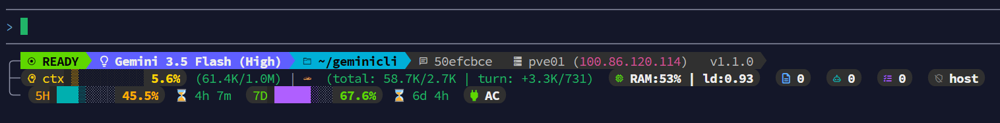
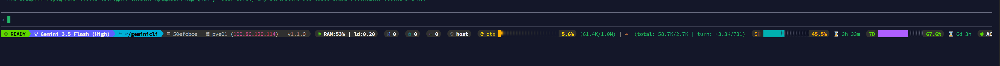
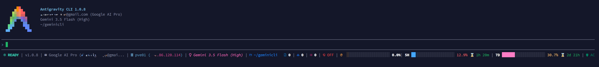
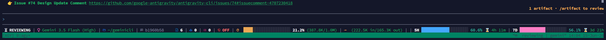
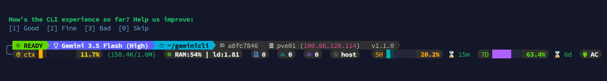
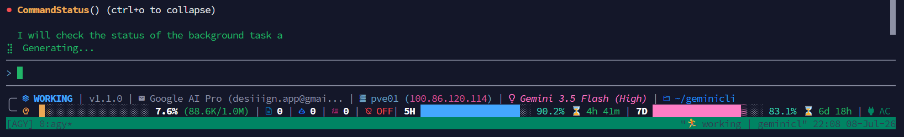
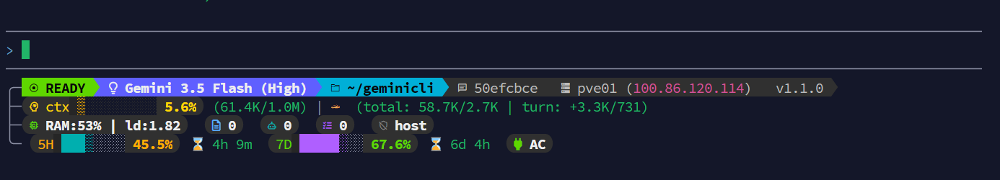
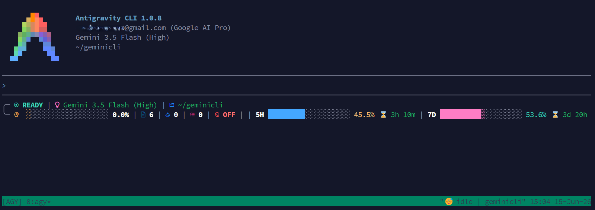

# Antigravity CLI Statusline

[](https://github.com/weby-homelab/antigravity-cli-statusline/releases/latest)
[](#supported-platforms)

Add an adaptive telemetry statusline to [Antigravity CLI](https://github.com/weby-homelab/antigravity-cli). It shows session, model, Git, context, quota, sandbox, task, host, and power data, then packs available fields across rows as terminal width changes.



> [!NOTE]
> The Weby Homelab community fork of Antigravity CLI installs this statusline by default. Follow this README to install it with another Antigravity CLI build, reinstall it, or change its display mode.

## What the statusline shows

The renderer combines live runtime telemetry from the Antigravity CLI payload with local Git, system diagnostics, and hardware metrics:

- **Session & Vim Mode**:
  - **Agent State**: `READY` (idle), `THINKING` (processing), `WORKING` (background ops), or `TOOL` (running tools).
  - **Vim Editor Mode**: dynamic indicator rendered in LINE1 right next to agent state:
    - Styled 256-color mode: `NORMAL` (Blue), `INSERT` (Bright Green), `VISUAL` / `VISUAL LINE` (Magenta / Purple), and fallback (Cyan).
    - Classic ASCII mode: `[NORMAL]`, `[INSERT]`, `[VISUAL]`, `[VISUAL LINE]`.
  - **Model & Account**: active LLM model ID/display name, user plan tier (`PLAN_TIER`), authenticated account email (`USER_EMAIL`), conversation ID prefix (at widths >= 80 cols), and CLI version.
- **Workspace**:
  - Shortened current working directory path.
  - Active VCS/Git branch name with real-time dirty status (`*` with red accent when unstaged/staged modifications exist).
- **Usage & Metrics**:
  - **Context Window**: dynamic usage bar (`ctx` with 10 or 20 segments) with percentage (`14.2%`) and precise token counters: active used tokens vs context window limit (`149.3K / 1.0M`). Uses explicit `total_tokens` when provided by the CLI or falls back to summing `total_input_tokens + total_output_tokens`.
  - **Token Metrics**: session tokens sum and turn delta counters (`turn: +IN/OUT`) on expanded layouts.
  - **Model-Aware Quota**: automatically prioritizes third-party quotas (`3p-5h`, `3p-weekly`) when using Claude, GPT, or OpenAI models, and Gemini quotas (`gemini-5h`, `gemini-weekly`) when using Gemini models. Cleanly hides when no quota is active.
  - **Quota Reset Countdown**: remaining time until the active quota window resets (`⌛`).
- **Execution & Orchestration**:
  - **Sandbox Status**: network mode indicator (`󰒙 ON (net)`, `󰴴 ON (no-net)`, or `󰦜 sandbox off`).
  - **Artifacts**: count of active output artifacts (``).
  - **Subagents**: live counter of spawned background subagents (`󱙺`) reflecting canonical technical truth immediately upon creation (0 -> 1, 0 -> 3).
  - **Background Tasks**: count of running asynchronous background tasks (``).
- **Host & System Diagnostics**:
  - Hostname and Tailscale IPv4 address when available (`󰒋`).
  - Power source (`󰚥 AC`) and battery charge percentage (`🔋 BAT`).
  - Linux host diagnostics: real-time CPU 1-minute load average and RAM utilization percentage extracted directly from `/proc/loadavg` and `/proc/meminfo`.

The statusline reads Antigravity CLI data from standard input. The renderer itself does not send session data over the network.

## Choose a display mode

The default preset uses 256-color ANSI styling and [Nerd Fonts 3](https://www.nerdfonts.com/) glyphs. Its line-packing engine measures each telemetry badge and dynamically flows badges into cleanly framed boxed rows (`╭─`, `├─`, `╰─`) without line wrapping.

| Terminal width | Layout tier | Context bar | Quota bar | Telemetry density & packing |
| :--- | :--- | :---: | :---: | :--- |
| **>= 235 columns** | **Ultra-Wide single/multi-row** | 20 segments | 15 segments | Maximized wide-bar with full plan, email, CPU/RAM, battery, and turn tokens. |
| **180 – 234 columns** | **Maximized wide terminal** | 10 segments | 8 segments | Expanded badges with user email, plan tier, full model and branch names. |
| **130 – 179 columns** | **Medium-Wide 2-row layout** | 10 segments | 8 segments | 2-row boxed layout balancing session data on row 1 and usage/host on row 2. |
| **100 – 129 columns** | **Medium terminal layout** | 10 segments | 8 segments | Multiline boxed packing with model, branch, context, and quota. |
| **60 – 99 columns** | **Compact & dense packing** | 10 segments | 8 segments | Responsive truncation of long names with vertical stacking (up to 4+ rows) to prevent overflow. |

Both the Bash and PowerShell renderers share identical adaptive bar sizing, Vim mode styling, and line packing. The final row count dynamically depends on the telemetry available in the current session.

<details open>
<summary><b>📸 Visual Screenshot Gallery Across All Terminal Widths</b></summary>
<br>

### 1. Ultra-Wide (>= 235 cols) — Wide Bar Single-Row Layout
*3652×243 resolution — Expanded 20-segment context bar and 15-segment quota bar with maximized single-line telemetry.*



---

### 2. Ultra-Wide (>= 235 cols) — Maximized Multi-Row Telemetry Dashboard
*3054×343 resolution — Full host diagnostics with CPU load average, RAM utilization percentage, UPS battery status, subagents, and turn token deltas.*



---

### 3. Maximized Wide Terminal (180–234 cols)
*2848×192 resolution — Expanded wide terminal view showing active user subscription plan, account email, dirty Git branch, and session token sum.*



---

### 4. Medium-Wide Terminal (130–179 cols) — Clean 2-Row Auto-Packing
*1767×240 resolution — Automatic 2-row boxed layout (`╭─`, `╰─`) gracefully distributing session info on row 1 and context/usage/host on row 2.*



---

### 5. Medium Terminal (100–129 cols) — Standard & Grouped Layouts
*1516×187 and 1636×249 resolutions — Balanced multiline packing retaining full telemetry visibility across standard developer terminal splits.*




---

### 6. Compact & Dense Terminal (60–99 cols) — High-Density Responsive Packing
*1386×250 and 1599×565 resolutions — Smart dynamic packing adapting to small split panes and mobile SSH sessions; vertically stacks into 4+ rows with zero horizontal clipping.*





</details>

Use classic mode when your terminal does not have a Nerd Font. It replaces private-use glyphs and 256-color capsules with Unicode labels and 16-color ANSI output.

## Supported platforms

Install the implementation for your operating system:

| Platform | Renderer | Requirements | Optional integrations |
| --- | --- | --- | --- |
| Linux | `statusline.sh` | Bash and `jq` | Git, GNU `timeout`, Tailscale, `/proc`, `/sys/class/power_supply` |
| macOS | `statusline.sh` | Bash and `jq` | Git, Tailscale, `pmset` |
| Windows | `statusline.ps1` | Windows PowerShell 5.1 or newer | Git, Tailscale, Common Information Model (CIM) battery data |

Git is optional. Without it, the statusline omits live branch and dirty-state data.

## Install or upgrade

The installers copy the renderer and uninstaller to `~/.antigravity` (or `%USERPROFILE%\.antigravity` on Windows), configure `statusLine.type = "command"` in Antigravity CLI settings, stage files atomically using temporary files to avoid race conditions during background runner polling, and maintain a dedicated state snapshot (`statusline_installed_state.json`) for safe, non-destructive upgrades and uninstalls.

> [!WARNING]
> Run the installer as your normal account. Do not use `sudo`: the installer writes to your home directory.

> [!TIP]
> Review [`install.sh`](install.sh) or [`install.ps1`](install.ps1) before executing a remote script.

### Linux and macOS

Install `jq`, then run the installer with either `curl` or `wget`.

```bash
curl -fsSL https://raw.githubusercontent.com/weby-homelab/antigravity-cli-statusline/main/install.sh | bash
```

The equivalent `wget` command is:

```bash
wget -qO- https://raw.githubusercontent.com/weby-homelab/antigravity-cli-statusline/main/install.sh | bash
```

### Windows PowerShell

Run the installer from PowerShell:

```powershell
powershell -NoProfile -ExecutionPolicy Bypass -Command "iex (irm https://raw.githubusercontent.com/weby-homelab/antigravity-cli-statusline/main/install.ps1)"
```

Restart Antigravity CLI after installation. Rerun the same installer to upgrade the statusline.

## Configure the statusline

The installer updates one of these files:

- **Linux and macOS**: `~/.gemini/antigravity-cli/settings.json`
- **Windows**: `%USERPROFILE%\.gemini\antigravity-cli\settings.json`

A Linux configuration has this shape:

```json
{
  "statusLine": {
    "type": "command",
    "command": "/home/your_username/.antigravity/statusline.sh",
    "enabled": true
  }
}
```

On macOS, replace `/home/your_username` with `/Users/your_username`. On Windows, use this command value (quoting the path only if it contains spaces):

```json
{
  "statusLine": {
    "type": "command",
    "command": "powershell.exe -NoProfile -ExecutionPolicy Bypass -File C:/Users/your_username/.antigravity/statusline.ps1",
    "enabled": true
  }
}
```

### Use classic mode

Append `--classic` (or `-Classic` on Windows) to the configured command:

```json
{
  "statusLine": {
    "type": "command",
    "command": "/home/your_username/.antigravity/statusline.sh --classic",
    "enabled": true
  }
}
```

The Bash and PowerShell renderers also accept `--no-nerdfont` and `--compatibility`.

### Override the layout width

The Bash and PowerShell renderers accept flags that override the width reported by Antigravity CLI:

| Flag | Effective width | Intended result |
| --- | ---: | --- |
| `--compact` / `-Compact` | 89 columns | Compact packed output |
| `--medium` / `-Medium` | 120 columns | Medium packed output |
| `--medium-wide` / `-MediumWide` | 150 columns | Medium-wide packed output |

Append one flag to the `command` value in `settings.json`.

## Verify the installation

Check the installed version and print the live icon legend after installation.

### Linux and macOS

```bash
~/.antigravity/statusline.sh --version
~/.antigravity/statusline.sh --legend
```

The short forms are `-v` and `-l`.

### Windows PowerShell

```powershell
powershell -NoProfile -ExecutionPolicy Bypass -File "$HOME\.antigravity\statusline.ps1" -Version
powershell -NoProfile -ExecutionPolicy Bypass -File "$HOME\.antigravity\statusline.ps1" -Legend
```

The Windows renderer also accepts `--version`, `-v`, `--legend`, and `-l`.

<details>
<summary>View the graphical telemetry legend</summary>


</details>

## Run automated tests

The repository includes a comprehensive automated test suite with 16 public JSON fixtures and 5 test runners verifying renderer logic, CLI flags, Vim modes, token accounting, and installer migrations:

### Linux and macOS (Bash)

```bash
bash tests/run_all.sh
```

The test runner validates:
- `tests/test_bash_renderer.sh`: 20 unit assertions across 14 terminal widths (60 to 255 columns).
- `tests/test_timeout.sh`: Stdin timeout guard and bounded subshell fallback on hung inputs without GNU timeout.
- `tests/test_subagent_cache.sh`: State transitions (0 -> 1, 1 -> 0, 0 -> 3) verifying canonical technical truth.
- `tests/test_install_bash.sh`: Fresh installation, non-destructive upgrades, state snapshot rollback, and symlink preservation.
- `tests/test_windows.py`: Cross-platform Windows UTF-8 BOM, `powershell.exe` command quoting, and `PSCustomObject` mutation checks.

### Windows (PowerShell & Python)

```powershell
powershell.exe -NoProfile -ExecutionPolicy Bypass -File .\tests\test_powershell_renderer.ps1
python tests\test_windows.py
```

## Understand installed files

The installation keeps its executable files separate from Antigravity CLI settings:

```text
~/.antigravity/
├── statusline.sh
└── uninstall.sh

~/.gemini/antigravity-cli/
├── settings.json
├── statusline_installed_state.json  # State snapshot for safe rollback across upgrades
└── settings.json.bak                # Legacy backup file if present
```

Windows uses the same directory names under `%USERPROFILE%` and installs `statusline.ps1` plus `uninstall.ps1`. The committed production `statusline.ps1` includes a UTF-8 BOM (`\xef\xbb\xbf`) ensuring compatibility with Windows PowerShell 5.1 across all system locales.

## Uninstall

The uninstaller uses the dedicated state snapshot (`statusline_installed_state.json`) to perform a clean, non-destructive rollback:

- If `statusLine` did not exist before installation, the uninstaller removes only the `statusLine` key.
- If `statusLine` existed before installation, the uninstaller restores only its original pre-installation value.
- Any unrelated settings added before or after installation (such as theme or keybindings) remain completely intact.
- Symlinks to dotfiles repositories are preserved without breaking link targets.

Run the Linux or macOS uninstaller:

```bash
~/.antigravity/uninstall.sh
```

Run the Windows uninstaller:

```powershell
powershell.exe -NoProfile -ExecutionPolicy Bypass -File "$HOME\.antigravity\uninstall.ps1"
```

## Troubleshoot common problems

Use these checks when the statusline does not render as expected:

- **Icons appear as boxes**: install and select a Nerd Font 3 font, or add `--classic` to the configured command
- **No statusline appears**: confirm that `statusLine.enabled` is `true`, check the command path, and restart Antigravity CLI
- **Linux or macOS renderer exits**: run `jq --version`; the Bash implementation requires `jq`
- **Git data is missing**: install Git and confirm the current working directory belongs to a Git repository
- **Windows Illegal characters in path**: verify your command in `settings.json` does not contain literal escaped quotes around `-File`. The v0.2.4 installer handles spaces automatically using standard path syntax
- **Windows PowerShell 5.1 font or encoding errors**: `statusline.ps1` includes a UTF-8 BOM to prevent mojibake on non-UTF-8 Windows locales. Ensure the BOM is preserved
- **A narrow terminal adds more rows**: increase the terminal width or use a layout override (`--compact`, `--medium`) to test a fixed width
- **Host fields are missing**: the renderer omits diagnostics that the operating system or local tools do not expose

## Telemetry legend reference

Complete visual map of all Nerd Font icons, classic Unicode fallbacks, state badges, and dynamic layouts supported by the statusline (accessible anytime via `statusline.sh --legend` or `statusline.ps1 -Legend`):


## Release history

See [CHANGELOG.md](CHANGELOG.md) for versioned changes and [GitHub Releases](https://github.com/weby-homelab/antigravity-cli-statusline/releases) for downloadable release records.

<p align="center">
  Built in Ukraine under air raid sirens and blackouts ⚡<br>
  &copy; 2026 Weby Homelab
</p>
